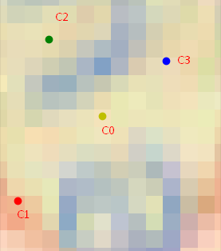
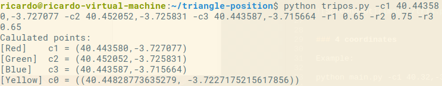
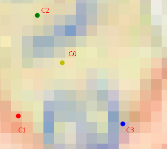

# triangle-position
Triangle position given 3 coordinates and 3 radios or 4 coordinates and 4 radios

## Usage

### 3 coordinates

*python main.py -c1 {coord_1} -c2 {coord_2} -c3 {coord_3} -r1 {ratio_1} -r2 {ratio_2} -r3 {ratio_3}*

Example 1:

*python tripos.py -c1 40.443580,-3.727077 -c2 40.452052,-3.725831 -c3 40.451418,-3.717722 -r1 0.65 -r2 0.75 -r3 0.65*

Result:

Example 2, changing C3:

*python tripos.py -c1 40.443580,-3.727077 -c2 40.452052,-3.725831 -c3 40.443587,-3.715664 -r1 0.65 -r2 0.75 -r3 0.65*

Result:

### 4 coordinates
*python main.py -c1 {coord_1} -c2 {coord_2} -c3 {coord_3} -c4 {coord_4} -r1 {ratio_1} -r2 {ratio_2} -r3 {ratio_3} -r4 {ratio_4}*

Example:

python main.py -c1 40.32,-3.85 -c2 41.32,-3.85 -c3 41.32,-4.85 -c4 40.32,-4.85 -r1 40 -r2 85 -r3 60 -r4 70

## Requirements

*sudo sh intall.sh*

Or:

*sudo apt-get install libgeos-3.6.2 libgeos-dev python-tk*

*sudo pip install pyproj geopy numpy matplotlib geopy matplotlib*

*sudo pip install https://github.com/matplotlib/basemap/archive/master.zip*

